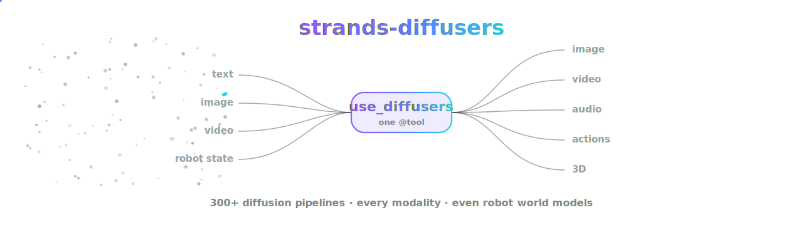
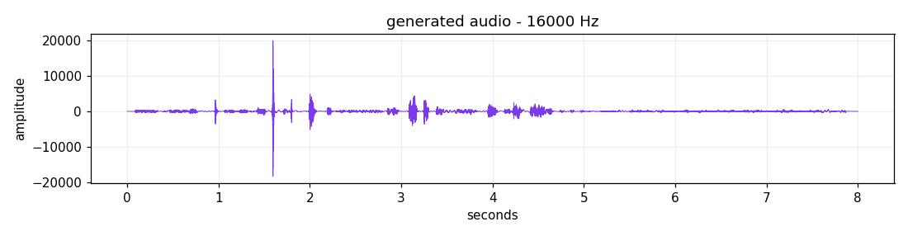
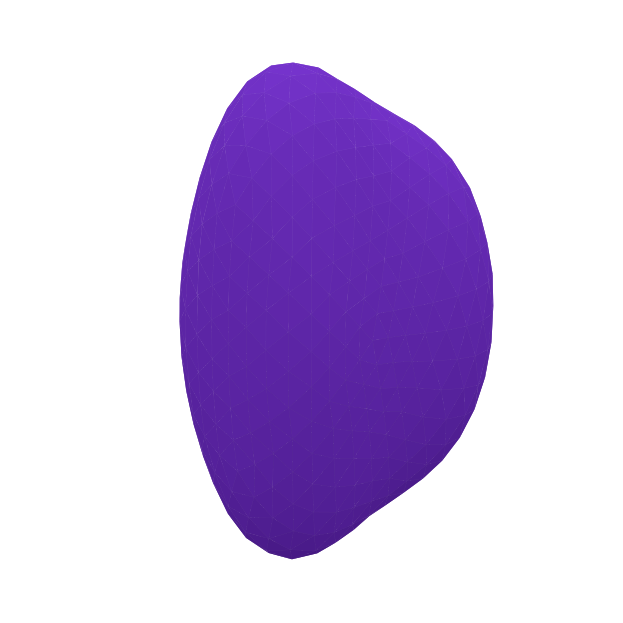
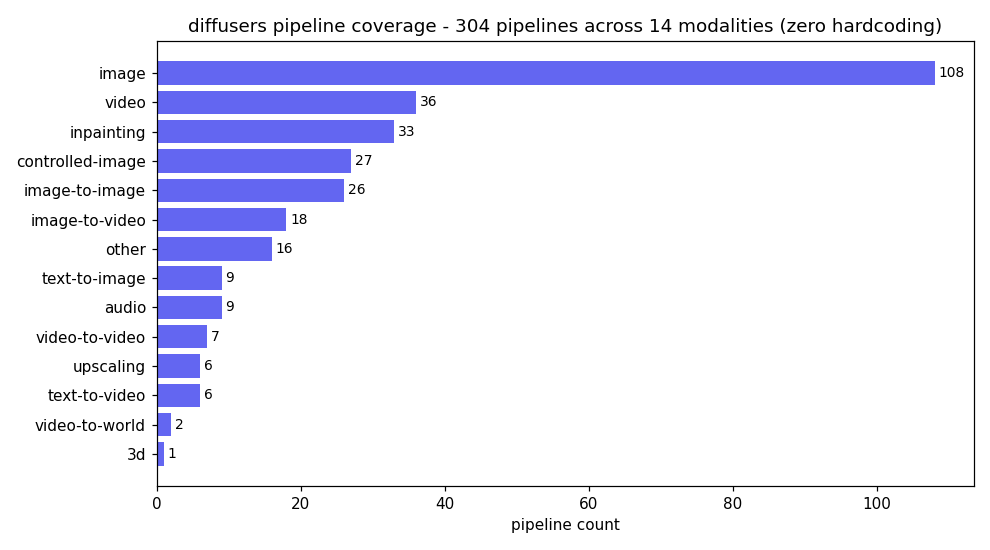
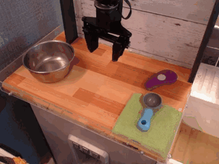
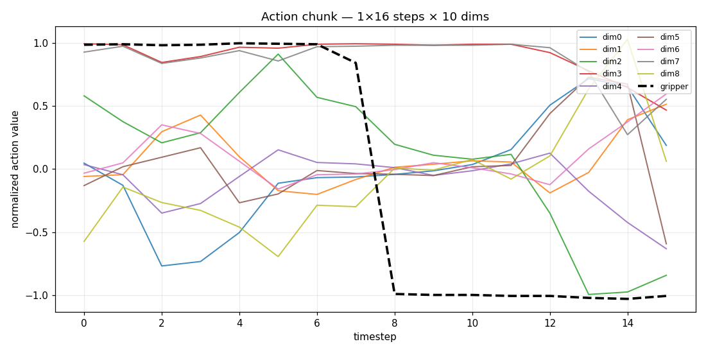
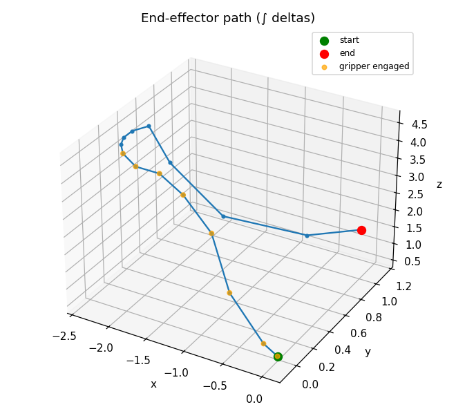

# strands-diffusers

<p align="center">
  
</p>

<p align="center">
  <a href="https://github.com/cagataycali/awesome-strands-agents"></a>
</p>


**The universal entrypoint to HuggingFace `diffusers` for Strands agents.**
One tool — `use_diffusers` — wraps the whole library with zero hardcoding:
discover and run any of its 300+ pipelines across every modality. It's a *visual*
library, so here's what it actually produces — every asset below is **real
model output**, not a placeholder:

<table>
  <tr>
    <td align="center" width="25%">
      <b>text → image</b><br/>
      <br/>
      <sub>any of 108 image pipelines</sub>
    </td>
    <td align="center" width="25%">
      <b>text → video</b><br/>
      <br/>
      <sub>LTX · Wan · CogVideoX · Hunyuan</sub>
    </td>
    <td align="center" width="25%">
      <b>robot actions</b> 🤖<br/>
      <br/>
      <sub>Cosmos WFM: world video + actions</sub>
    </td>
    <td align="center" width="25%">
      <b>text → audio</b><br/>
      <br/>
      <sub>StableAudio · AudioLDM2</sub>
    </td>
  </tr>
</table>

```
text / image / video / robot-state  IN
image / video / audio / actions / 3d  OUT
```

The registry is built at runtime from `diffusers._import_structure`, so new
pipelines are supported automatically with no code change. Same philosophy as
`use_aws`, `use_lerobot`, and `use_transformers`: **discover, don't hardcode.**

<table>
  <tr>
    <td align="center" width="50%">
      <b>3D mesh</b><br/>
      <br/>
      <sub>ShapE - verts/faces to .ply</sub>
    </td>
    <td align="center" width="50%">
      <b>audio</b> (<a href="docs/assets/text_to_audio.wav">hear the .wav</a>)<br/>
      <br/>
      <sub>StableAudio - waveform to .wav</sub>
    </td>
  </tr>
</table>

## 100% coverage, zero hardcoding

<p align="center">
  
</p>

Every pipeline, model, and scheduler diffusers ships is reachable through one
tool. When diffusers adds a new pipeline, `use_diffusers` exposes it immediately.

## Physical-AI: world-foundation models with action outputs

<p align="center">
  
</p>

<table>
  <tr>
    <td align="center"><br/><sub>"Put the pot to the left of the purple item."</sub></td>
    <td align="center"><br/><sub>"Pick up the cloth and place it in the bowl."</sub></td>
    <td align="center"><br/><sub>"Open the drawer and place the spoon inside."</sub></td>
  </tr>
</table>

Same robot, same first observation — **different task prompt → different imagined
world and different predicted actions.** Five real rollouts + all three Cosmos
action modes in the [WFM gallery](https://cagataycali.github.io/strands-diffusers/wfm/).


This is the headline. A Cosmos action-policy rollout predicts both a future world
**video** and the **robot action chunk** that produces it. One
`use_diffusers(action="run", ...)` returns a `.mp4` world video, a `.json` action
chunk (normalized `[-1, 1]`, shape `[num_chunks, T, action_dim]`), and optional
`.wav` sound — and you can *see* the motion:

<table>
  <tr>
    <td align="center"><b>time-series</b> (every dim, gripper highlighted)<br/></td>
    <td align="center"><b>end-effector path</b> (dims 0–2)<br/></td>
  </tr>
</table>

Verified end-to-end on NVIDIA Thor (`nvidia/Cosmos3-Nano`, bf16/cuda): one call
produced a world video `(17, 480, 640, 3)` and an action chunk `(1, 16, 10)`. See
[`examples/cosmos_action_policy.py`](examples/cosmos_action_policy.py).

## Install

```bash
pip install -e .
pip install -e ".[video,audio]"   # mp4 export, wav I/O
```

## Quick start

```python
from strands import Agent
from strands_diffusers import use_diffusers

agent = Agent(tools=[use_diffusers])
agent("Generate an image of a robot arm in a kitchen")
agent("Run a Cosmos action-policy rollout on robot.mp4 and give me the actions")
```

Direct:

```python
use_diffusers(action="run", pipeline="StableDiffusionPipeline",
              model="stabilityai/stable-diffusion-2-1",
              parameters={"prompt": "a robot arm in a kitchen"})
# -> {"artifacts": ["/tmp/strands_diffusers/image_*.png"]}
```

## Two layers

`run` loads a pipeline via `from_pretrained` and calls it; inputs are coerced
(path / URL / base64 to PIL / video), outputs auto-saved and returned by path.

`call` resolves and calls any diffusers class, function, or method (schedulers,
VAEs, `CosmosActionCondition`, utils). `cached:key` references resolve to live
objects; `"**"` unpacks a cached mapping into kwargs.

```python
use_diffusers(action="call", target="CosmosActionCondition",
              parameters={"mode": "policy", "video": "robot.mp4"}, cache_key="cond")
use_diffusers(action="run", pipeline="Cosmos3OmniPipeline", model="nvidia/Cosmos3-Nano",
              parameters={"prompt": "...", "action": "cached:cond"},
              dtype="bfloat16", device="cuda")
```

## Discovery

| action | returns |
|---|---|
| `pipelines` / `models` / `schedulers` | classes + derived modality |
| `tasks` / `modalities` / `wfm` | task maps / modality groups / world-foundation models |
| `pipeline_info` / `inspect` | signature + docs |
| `visualize` | action chunk to plots + animation |
| `cache` / `clear_cache` | manage loaded pipelines |

## Architecture

```
core/registry.py  zero-hardcode taxonomy from diffusers._import_structure
core/engine.py    load/cache pipelines, auto device+dtype
core/io.py        coerce inputs; serialize video/image/audio/action/mesh
core/viz.py       render robot action chunks to plots + animation
tools/use_diffusers.py  the single @tool: run + call + discovery
```

## Testing

```bash
pip install -e ".[video,audio,dev]"
pytest tests/ -q          # unit tests, no GPU, no downloads
python examples/smoke.py  # E2E gate on tiny fixtures
```

Every visual in this README and the [docs](https://cagataycali.github.io/strands-diffusers/)
is produced by real `use_diffusers` calls — regenerate them with:

```bash
python examples/generate_docs_assets.py
```

## Docs

📖 **[cagataycali.github.io/strands-diffusers](https://cagataycali.github.io/strands-diffusers/)**
— quickstart, full gallery (images / video / audio / actions / 3D), the
world-foundation-model story, discovery, and the two-layer design.

MIT
