# Find any pipeline

You don't need to memorize class names. `use_diffusers` reads the installed
`diffusers` library at runtime and tells you exactly what it can run. Add a new
pipeline to diffusers and it shows up here on its own — nothing to update.




<p>
<span class="sd-pill">image · 108</span>
<span class="sd-pill">video · 36</span>
<span class="sd-pill">inpainting · 33</span>
<span class="sd-pill">controlled-image · 27</span>
<span class="sd-pill">image-to-image · 26</span>
<span class="sd-pill">image-to-video · 18</span>
<span class="sd-pill">other · 16</span>
<span class="sd-pill">audio · 9</span>
<span class="sd-pill">text-to-image · 9</span>
<span class="sd-pill">video-to-video · 7</span>
<span class="sd-pill">text-to-video · 6</span>
<span class="sd-pill">upscaling · 6</span>
<span class="sd-pill">video-to-world · 2</span>
<span class="sd-pill">3d · 1</span>
</p>

## Ask what's available

| action | returns |
|---|---|
| `pipelines` | all pipeline classes + derived modality |
| `models` | all model/backbone classes |
| `schedulers` | all scheduler classes |
| `tasks` | task → pipeline map |
| `modalities` | pipelines grouped by modality |
| `wfm` | world-foundation / action models |
| `pipeline_info` | constructor signature + docstring for one pipeline |
| `inspect` | signature + docs for any class, function, or method |
| `cache` / `clear_cache` | manage loaded pipelines in memory |

## Browse by modality

```python
from strands_diffusers import use_diffusers

groups = use_diffusers(action="modalities")["data"]
# {'image': 108, 'inpainting': 33, 'video': 36, 'controlled-image': 27,
#  'image-to-image': 26, 'image-to-video': 18, 'other': 16, 'audio': 9,
#  'text-to-image': 9, 'video-to-video': 7, 'text-to-video': 6,
#  'upscaling': 6, 'video-to-world': 2, '3d': 1}

groups["audio"]    # ['AudioLDM2Pipeline', 'MusicLDMPipeline', 'StableAudioPipeline', ...]
groups["3d"]       # ['ShapEPipeline', ...]
```

## Inspect before you run

Don't remember a pipeline's arguments? Ask:

```python
use_diffusers(action="pipeline_info", target="StableDiffusionPipeline")
# -> constructor signature, accepted call kwargs, and the docstring

use_diffusers(action="inspect", target="DDIMScheduler")
use_diffusers(action="inspect", target="utils.export_to_video")
```

## Why this matters

Hardcoded lists go stale the day diffusers ships a new model. Reading the library
at runtime means:

- the list always matches *your* installed version,
- the agent can browse options and pick the right one, and
- there's nothing to maintain when new pipelines land upstream.

Same idea as `use_aws`, `use_lerobot`, and `use_transformers`: **ask, don't hardcode.**
