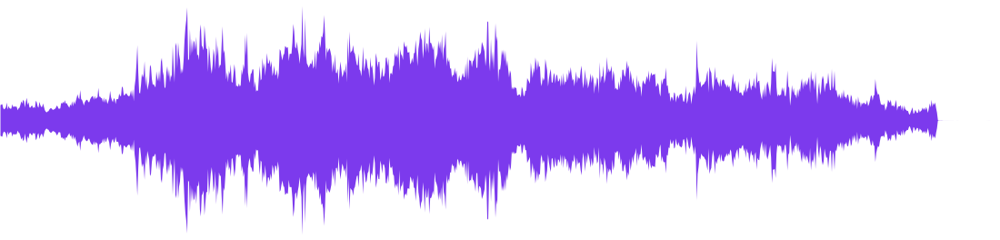
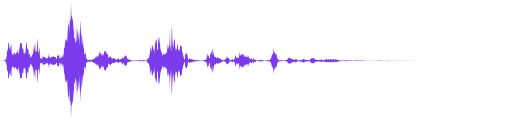
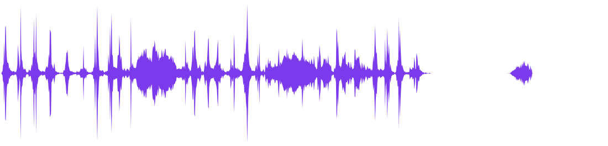

# Audio

Every clip below is **real** `stabilityai/stable-audio-open-1.0` output (fp16/cuda) —
one `use_diffusers` call each, **44.1 kHz stereo**, written straight to `.wav`. The
sample rate comes from the model, never assumed.


<div class="grid cards" markdown>

-   __“A dog barking in a backyard”__

    

    <audio controls preload="none" style="width:100%">
      <source src="../../assets/audio_dog.wav" type="audio/wav">
      <a href="../../assets/audio_dog.wav">download .wav</a>
    </audio>

-   __“Heavy rain and rolling thunder”__

    

    <audio controls preload="none" style="width:100%">
      <source src="../../assets/audio_rain.wav" type="audio/wav">
      <a href="../../assets/audio_rain.wav">download .wav</a>
    </audio>

-   __“Birds chirping in a forest at dawn”__

    

    <audio controls preload="none" style="width:100%">
      <source src="../../assets/audio_birds.wav" type="audio/wav">
      <a href="../../assets/audio_birds.wav">download .wav</a>
    </audio>

-   __“Mechanical keyboard typing quickly”__

    

    <audio controls preload="none" style="width:100%">
      <source src="../../assets/audio_typing.wav" type="audio/wav">
      <a href="../../assets/audio_typing.wav">download .wav</a>
    </audio>

</div>

## Music, too

The same model does music. Here's a 10-second lo-fi beat — one call, stereo:

<audio controls preload="none" style="width:100%">
  <source src="../../assets/text_to_audio.wav" type="audio/wav">
  <a href="../../assets/text_to_audio.wav">download .wav</a>
</audio>

## One call

```python
from strands_diffusers import use_diffusers

use_diffusers(
    action="run",
    pipeline="StableAudioPipeline",
    model="stabilityai/stable-audio-open-1.0",
    parameters={"prompt": "A dog barking in a backyard",
                "negative_prompt": "low quality, muffled",
                "audio_end_in_s": 5.0,
                "num_inference_steps": 120},
    dtype="float16", device="cuda",
)
# -> artifacts: ['/tmp/strands_diffusers/audio_*.wav']  (44.1 kHz stereo)
```

!!! note "Scheduler is handled for you"
    `stable-audio-open-1.0` ships with `CosineDPMSolverMultistepScheduler`, which
    depends on `torchsde` — and that hits a `RecursionError` on some torch builds.
    `use_diffusers` automatically swaps it for the equivalent non-SDE
    `DPMSolverMultistepScheduler`, so the call above just works. Want the original?
    Set `STRANDS_DIFFUSERS_KEEP_SDE_SCHEDULER=1`.

Stereo is preserved end-to-end: output is written as `[N, C]` whether the model
returns channels-first `[C, N]` or channels-last `[N, C]`, and the time axis is
always kept.

## Find an audio pipeline

```python
use_diffusers(action="modalities")["data"]["audio"]
# ['AceStepPipeline', 'AudioLDMPipeline', 'AudioLDM2Pipeline',
#  'MusicLDMPipeline', 'StableAudioPipeline', 'DanceDiffusionPipeline', ...]
```

| model | rate | best for |
|-------|------|----------|
| **stable-audio-open-1.0** | 44.1k stereo | sound effects, ambience, short music |
| **ACE-Step-v1-3.5B** | 44.1k stereo | full songs with vocals |
| musicgen | 32k | instrumental music |
| audioldm2 | 16k | speech / SFX |
