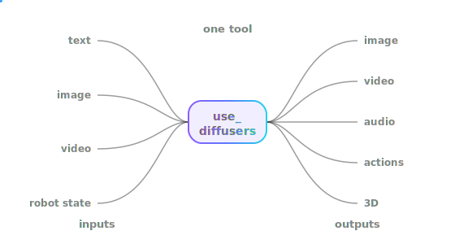
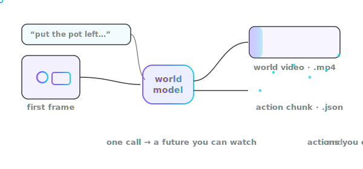
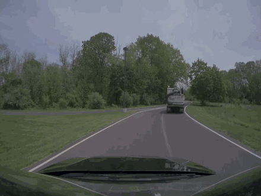

# strands-diffusers

<div class="sd-hero" markdown>

## One tool. Any diffusion model. Even robot brains.

`use_diffusers` gives a Strands agent every HuggingFace **diffusers** pipeline —
images, video, audio, 3D, and the one that matters most: **robot world models
that output runnable actions.**

<span class="sd-tag">text · image · video · robot state  IN  →  image · video · audio · actions · 3D  OUT</span>

</div>



## Start with robots

A **world model** doesn't just imagine a video of the future — it predicts the
**robot actions** that get there. NVIDIA Cosmos answers three questions, and one
`use_diffusers` call answers each:



<div class="grid cards" markdown>

-   __What should the robot do?__

    { width="300" }

    Give it a camera frame and a task. Get back the imagined future **and** the
    action chunk to execute. *(the policy)*

-   __What happens if I run these actions?__

    { width="300" }

    Give it a start frame and a set of actions. Get back the world they would
    produce. *(forward dynamics)*

-   __What actions made this video?__

    { width="300" }

    Give it a video you recorded. Get back the actions that connect the frames.
    *(inverse dynamics)*

</div>

Every clip above is a **real** `nvidia/Cosmos3-Nano` rollout — one call returned a
world video `(17, 480, 640, 3)` and an action chunk `(1, 16, 10)`, saved straight
to `.mp4` + `.json` (normalized `[-1, 1]`, ready for your controller).

```python
from strands_diffusers import use_diffusers

# "What should the robot do?" — one call, video + actions back
use_diffusers(action="run", pipeline="Cosmos3OmniPipeline",
              model="nvidia/Cosmos3-Nano",
              parameters={"prompt": "Put the pot left of the purple item.",
                          "action": "cached:cond"},
              dtype="bfloat16", device="cuda")
```

You can even **see** the motion before touching hardware:

| every joint over time | the gripper's path |
|---|---|
|  |  |

[Read the full robot story →](wfm.md){ .md-button .md-button--primary }

## The same tool does everything else

Robots are the headline, but `use_diffusers` is one door to the whole diffusers
library. Same call, different pipeline:

<div class="grid cards" markdown>

-   __text → image__

    { width="220" }

    ```python
    use_diffusers(action="run",
      pipeline="StableDiffusionPipeline",
      model="stabilityai/stable-diffusion-2-1",
      parameters={"prompt": "a robot arm in a kitchen"})
    ```

-   __text → video__

    { width="220" }

    ```python
    use_diffusers(action="run",
      pipeline="LTXPipeline", model="...",
      parameters={"prompt": "a robot moving a cube",
                  "num_frames": 81}, fps=16)
    ```

-   __text → audio__

    { width="220" }

    ```python
    use_diffusers(action="run",
      pipeline="StableAudioPipeline", model="...",
      parameters={"prompt": "lo-fi beat"})
    ```

-   __text → 3D mesh__

    { width="220" }

    ```python
    use_diffusers(action="run",
      pipeline="ShapEPipeline", model="openai/shap-e",
      parameters={"prompt": "a shark"})
    ```

</div>

## How it stays simple

You never memorize class names. The agent **asks the library what it has**, picks
a pipeline, runs it, and hands you back file paths.

```python
from strands import Agent
from strands_diffusers import use_diffusers

agent = Agent(tools=[use_diffusers])
agent("Generate an image of a robot arm in a kitchen")
agent("Run a Cosmos rollout on robot.mp4 and give me the actions")
```

The list of pipelines is read from the installed `diffusers` at runtime — so when
the library adds a model, it just works, with nothing to update here. Same idea as
`use_aws`, `use_lerobot`, and `use_transformers`: **ask, don't hardcode.**

## Next

- [Robot world models](wfm.md) — the full action story, every mode, real rollouts
- [Quickstart](quickstart.md) — installed and running in five lines
- [Gallery](gallery/images.md) — every output, nothing faked
