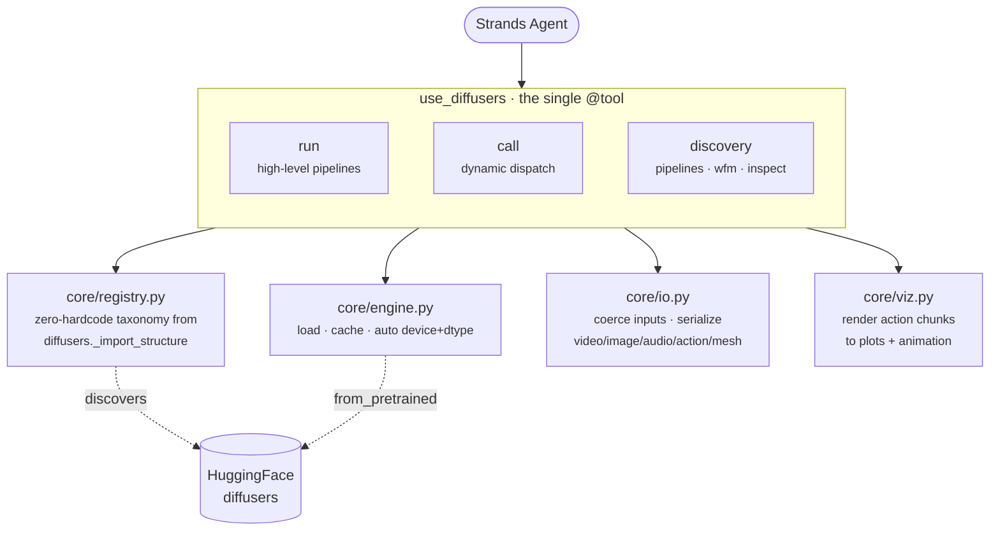

# How it works

`use_diffusers` exposes the entire diffusers library through exactly two
execution layers — a high-level `run` and a low-level `call` — plus the
[discovery](discovery.md) actions.



## `run` — high-level pipelines

Give it a `pipeline` class name, a `model` repo, and `parameters`. It loads (and
caches) the pipeline via `from_pretrained`, coerces inputs (path / URL / base64 →
PIL / video), runs it, and serializes **every** output to an artifact path.

```python
from strands_diffusers import use_diffusers

r = use_diffusers(
    action="run",
    pipeline="StableDiffusionPipeline",
    model="stabilityai/stable-diffusion-2-1",
    parameters={"prompt": "a robot arm in a kitchen", "num_inference_steps": 25},
)
print(r["artifacts"])   # -> ['/tmp/strands_diffusers/image_*.png']
```

Outputs auto-save by modality:

| output | artifact |
|---|---|
| image | `.png` |
| video | `.mp4` (imageio fallback, gif last resort) |
| audio | `.wav` (sample rate read from the model) |
| **action** | `.json` (normalized `[-1, 1]`, full chunk + metadata) |
| 3D mesh | `.ply` / `.obj` (`.npz` lossless fallback) |

{ width="256" }

## `call` — low-level dynamic dispatch

Resolve and call **any** diffusers class, function, or method: schedulers, VAEs,
`CosmosActionCondition`, `utils.export_to_video`, or a method on a cached
pipeline. This is the escape hatch that reaches everything `run` doesn't.

```python
# call a utility function
use_diffusers(action="call", target="utils.export_to_video",
              parameters={"video_frames": "cached:frames", "fps": 16})

# construct an object and stash it
use_diffusers(action="call", target="CosmosActionCondition",
              parameters={"mode": "policy", "video": "robot.mp4"},
              cache_key="cond")
```

### Cached references

`cache_key` stashes a constructed object; `cached:key` feeds it back into a later
call. `{"**": "cached:key"}` unpacks a cached mapping into kwargs. This is how the
Cosmos example builds an action condition and threads it into the pipeline run:

```python
use_diffusers(action="call", target="CosmosActionCondition",
              parameters={"mode": "policy", "video": "robot.mp4"}, cache_key="cond")

use_diffusers(action="run", pipeline="Cosmos3OmniPipeline",
              model="nvidia/Cosmos3-Nano",
              parameters={"prompt": "...", "action": "cached:cond"},
              dtype="bfloat16", device="cuda")
```

## When to use which

| you want to… | layer |
|---|---|
| generate an image/video/audio/action from a known pipeline | `run` |
| swap a scheduler, call a VAE, run a util, build a condition object | `call` |
| chain a constructed object into a later run | `call` + `cache_key` / `cached:` |
| find out what's available | [find a pipeline](discovery.md) |

## Architecture


