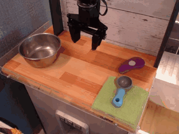
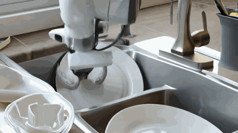
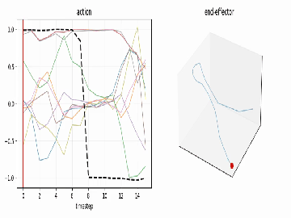
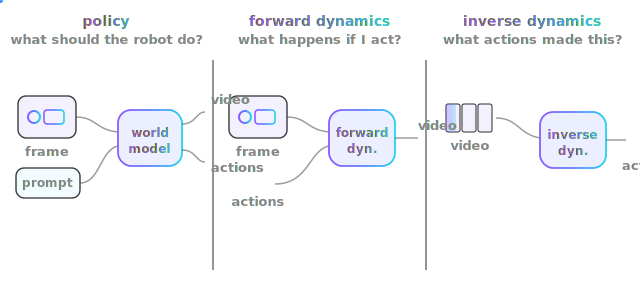
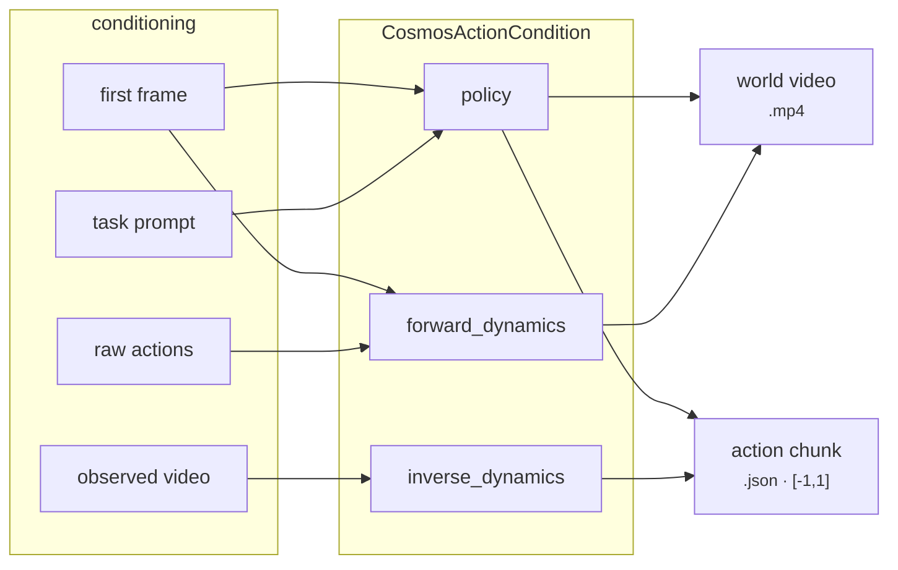
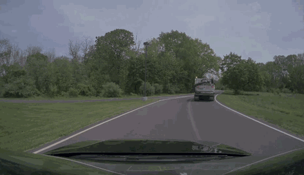
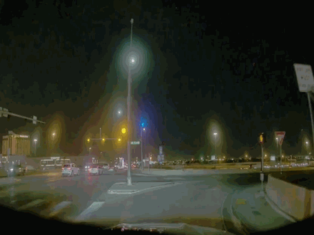

# Robot world models

This is why strands-diffusers exists. A **world model** doesn't just paint a
believable future — it predicts the **robot actions** that produce it. NVIDIA
Cosmos is the headline: one call returns a future **video**, an optional **sound**
track, and a normalized **action** tensor your controller can run.

Every clip below is a **real** `nvidia/Cosmos3-Nano` rollout (bf16/cuda) from a
single `use_diffusers` call — not a placeholder.

 world model -> world video + action chunk" />

## Action-policy rollouts

Same robot, same starting observation — **different task prompt**, different
imagined future **and** different predicted actions. This is the policy mode:
condition on a first observation, give it a task, get back the world it would
create and the action chunk `(1, 16, 10)` that gets there.

<div class="grid cards" markdown>

-   __"Put the pot to the left of the purple item."__

    { width="320" }

-   __"Pick up the cloth and place it in the bowl."__

    { width="320" }

-   __"Move the gripper toward the metal pan and grasp the handle."__

    { width="320" }

-   __"Open the drawer and place the spoon inside."__

    { width="320" }

-   __"Wipe the surface with the cloth in a circular motion."__

    { width="320" }

-   __text-to-world (no action conditioning)__

    { width="320" }

</div>

```python
from strands_diffusers import use_diffusers

# 1) build an action condition from an observation video (low-level `call`)
use_diffusers(action="call", target="CosmosActionCondition",
              parameters={"mode": "policy", "chunk_size": 16,
                          "domain_name": "bridge_orig_lerobot",
                          "resolution_tier": 480, "video": "robot.mp4",
                          "view_point": "ego_view"},
              cache_key="cond")

# 2) run the world-foundation pipeline, threading the cached condition in
use_diffusers(action="run", pipeline="Cosmos3OmniPipeline",
              model="nvidia/Cosmos3-Nano",
              parameters={"prompt": "Put the pot to the left of the purple item.",
                          "action": "cached:cond", "fps": 5,
                          "num_inference_steps": 30, "guidance_scale": 1.0},
              dtype="bfloat16", device="cuda")
```

Each call above returned a world video `(17, 480, 640, 3)` and an action chunk
`(1, 16, 10)`, normalized to `[-1, 1]`.

## The headline: world + action from one call

<div class="grid" markdown>

<figure markdown>
  { width="380" }
  <figcaption>The <b>world video</b> Cosmos predicts.</figcaption>
</figure>

<figure markdown>
  { width="360" }
  <figcaption>The <b>robot action chunk</b> that produces it, rendered straight
  from the predicted tensor.</figcaption>
</figure>

</div>

## Three action modes

Cosmos exposes the full physical-AI loop through one `CosmosActionCondition` —
the same object, three directions through the world model:





| mode | conditioning | predicts | use it for |
|---|---|---|---|
| `policy` | first frame + task prompt | future video **+ actions** | "what should the robot do?" |
| `forward_dynamics` | first frame + given `raw_actions` | future video | "what happens if I run these actions?" |
| `inverse_dynamics` | an observed video | the actions between frames | "what actions produced this?" |

```python
# forward dynamics: roll the world forward from actions you already have
use_diffusers(action="call", target="CosmosActionCondition",
              parameters={"mode": "forward_dynamics", "chunk_size": 16,
                          "domain_name": "agibotworld", "resolution_tier": 480,
                          "image": "first_frame.png", "raw_actions": chunks},
              cache_key="fd")

# inverse dynamics: recover the actions from a video you observed
use_diffusers(action="call", target="CosmosActionCondition",
              parameters={"mode": "inverse_dynamics", "chunk_size": 16,
                          "domain_name": "bridge_orig_lerobot",
                          "video": "observed.mp4"}, cache_key="id")
```

### Inverse dynamics, seen

Feed an **observed** robot video; Cosmos reconstructs the world and infers the
action chunk that connects the frames. Observed input (left) → model rollout
(right):

<div class="grid" markdown>

<figure markdown>
  { width="340" }
  <figcaption>observed video (input)</figcaption>
</figure>

<figure markdown>
  { width="340" }
  <figcaption>reconstructed world + inferred actions</figcaption>
</figure>

<figure markdown>
  { width="340" }
  <figcaption>a second observation</figcaption>
</figure>

<figure markdown>
  { width="340" }
  <figcaption>its inferred rollout</figcaption>
</figure>

</div>

## See the motion

`use_diffusers(action="visualize", ...)` turns any action chunk into plots and an
animation so you can *read* the trajectory before you ever touch hardware:

| time-series (every dim, gripper highlighted) | end-effector path (dims 0–2) |
|---|---|
|  |  |

```python
use_diffusers(action="visualize", inputs=action_chunk, parameters={"fps": 8})
# -> timeseries.png, trajectory.png, animation.mp4
```

## What comes back

A Cosmos `Cosmos3OmniPipelineOutput` carries three fields, and the serializer
writes each to the right artifact — no opaque repr strings:

| field | artifact | notes |
|---|---|---|
| `video` | `.mp4` | future world, via `export_to_video` |
| `sound` | `.wav` | optional audio track |
| `action` | `.json` | normalized `[-1, 1]`, shape `[num_chunks, T, action_dim]` |

```json
{
  "type": "action",
  "chunk_shape": [16, 10],
  "num_chunks": 1,
  "path": "/tmp/strands_diffusers/action_*.json"
}
```

The `.json` is the model-normalized chunk (values in `[-1, 1]`). Feed it straight
to your embodiment's un-normalizer and controller. Values are preserved exactly
(no lossy clipping); bf16 tensors are upcast to f32 before serialization.

## The WFM family

`use_diffusers(action="wfm")` lists every world-foundation / action-capable
pipeline diffusers ships — discovered at runtime, never hardcoded:

```python
use_diffusers(action="wfm")
# ['Cosmos2TextToImagePipeline', 'Cosmos2VideoToWorldPipeline',
#  'CosmosTextToWorldPipeline', 'CosmosVideoToWorldPipeline',
#  'HunyuanVideoPipeline', 'WanImageToVideoPipeline', 'WanPipeline', ...]
```

27 world-foundation models today; the list grows automatically as diffusers adds
new architectures.

## Reproduce these

The rollout gallery above is generated by a real, GPU script:

```bash
pip install 'git+https://github.com/huggingface/diffusers' --no-deps --target /tmp/dmain
PYTHONPATH=/tmp/dmain python examples/generate_wfm_rollouts.py
```

See also [`examples/cosmos_action_policy.py`](https://github.com/cagataycali/strands-diffusers/blob/main/examples/cosmos_action_policy.py)
for the single-rollout walkthrough with a graceful CPU/no-GPU fallback.
